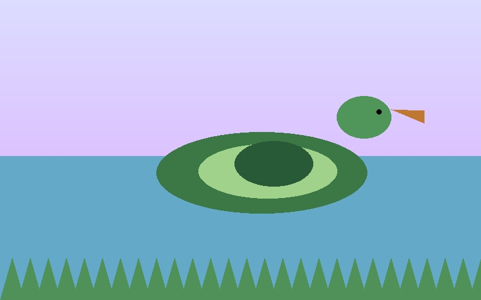

Mallard ducks are among the most familiar waterfowl in Europe and North America, recognizable by their iridescent green heads, warm brown bodies, and habit of feeding in shallow wetlands. Their movements often follow seasonal changes in food, water, and breeding conditions, making them especially useful for studying how animals respond to environmental variation.

Lake Constance, on the border of Germany, Switzerland, and Austria, is one of the largest freshwater lakes in Central Europe and a major stopover and breeding area for migratory birds. The lake’s wetlands and surrounding agricultural landscapes provide ideal conditions for mallards, which makes it a strong setting for tracking their daily and seasonal movements.

The GPS tracking data reveal repeated patterns in where these ducks move, how far they travel, and when they are most active. By following individual birds across time, researchers can see how their movements shift across months and seasons, highlighting both routine habitat use and the effect of environmental conditions on migration and local movement.

<div style="display: flex; justify-content: center;">
  
</div>

```{r}
#| message: false
#| cache: true
mallards <- readRDS("data/mallards.rds")
```
